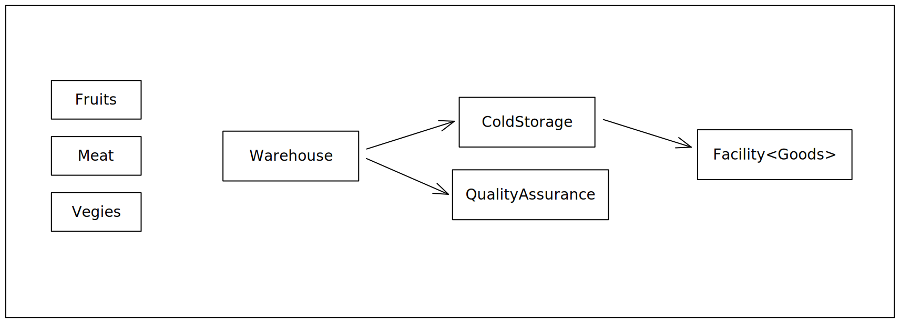

# Warehouse

## Warehouse Management System with Quality Assurance

This project involves the development of a Warehouse Management System (WMS) that integrates quality assurance mechanisms to ensure the storage and management of goods within a warehouse facility. The system is designed to handle various aspects of warehousing, including validating goods, ensuring their quality, and managing their storage.

### Project Overview

The main components of the system include a **ColdStorage** facility, various **Facilities** for storing different types of goods, a **GoodsQualityAssurance** module for quality control, and a **Warehouse** class that orchestrates the entire process.

- **ColdStorage**: This serves as the central storage facility within the warehouse. It is responsible for receiving and storing goods while considering available capacity. Goods are categorized based on their types and stored in corresponding **Facilities**. If a specific **Facility** doesn't exist for a certain type of goods, the system notifies the client.

- **Facility**: These are specialized storage units designed to hold specific types of goods. They are responsible for managing their own capacities and providing reports on their status. Each facility keeps track of available storage slots and ensures goods are stored appropriately.

- **GoodsQualityAssurance**: This component is crucial for validating the quality of goods before storage. It filters out expired goods and ensures that only valid items are accepted for storage. If all goods are expired, the system imposes fines on the client. This module plays a pivotal role in maintaining the overall quality and integrity of stored goods.

- **Warehouse**: The Warehouse class acts as the core orchestrator, integrating the various components together. It handles the coordination of quality assurance checks and the subsequent storage of goods. In cases where multiple goods need to be stored simultaneously, the system employs multithreading and synchronization to ensure efficient and error-free operations.

### Error Handling

The project incorporates an extensive error handling mechanism through the use of custom error types. These errors include:
- **badGoods**: Indicates that all goods are expired, leading to a fine for the client.
- **unsupportedFacility**: Occurs when the warehouse lacks a suitable facility for a specific type of goods, prompting the need to construct a corresponding facility.
- **unsupportedGoods**: Arises when inappropriate goods are attempted to be stored in a certain facility, indicating a Quality Assurance error.
- **full**: Denotes that a facility is at full capacity, requiring either the construction of new facilities or the removal of items.

### Conclusion

The Warehouse Management System with Quality Assurance provides a comprehensive solution for efficiently managing goods within a warehouse environment. By integrating quality control and facility management, this project ensures that only valid, high-quality items are stored, while offering a seamless experience for both warehouse operators and clients. Through the effective use of error handling and modular design, the system optimizes storage operations and maintains the integrity of stored goods.
